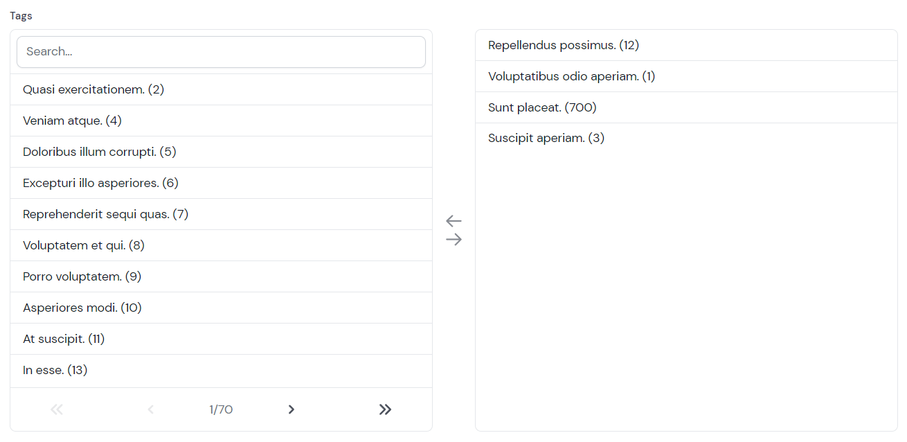

# Belongs To Many field for Filament

The Belongs to Many Field allows you to select multiple items from a list and save them on the Edit page, without the use of a relation manager.



## Installation

You can install the package via composer:

```bash
composer require codedor/filament-belongs-to-many
```

## Documentation

For the full documentation, check [here](./docs/index.md).

## Testing

```bash
vendor/bin/pest
```

## Changelog

Please see [CHANGELOG](CHANGELOG.md) for more information on what has changed recently.

## Upgrading

Please see [UPGRADING](UPGRADING.md) for more information on how to upgrade to a new version.

## Contributing

Please see [CONTRIBUTING](CONTRIBUTING.md) for details.

## Security Vulnerabilities

If you discover any security-related issues, please email info@codedor.be instead of using the issue tracker.

## License

The MIT License (MIT). Please see [License File](LICENSE.md) for more information.
